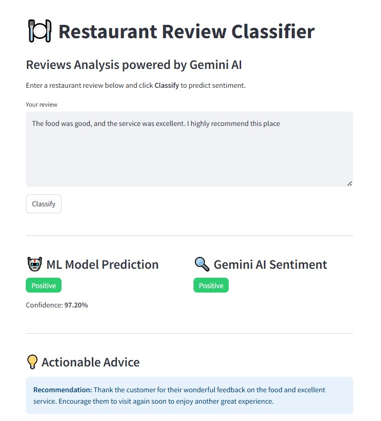
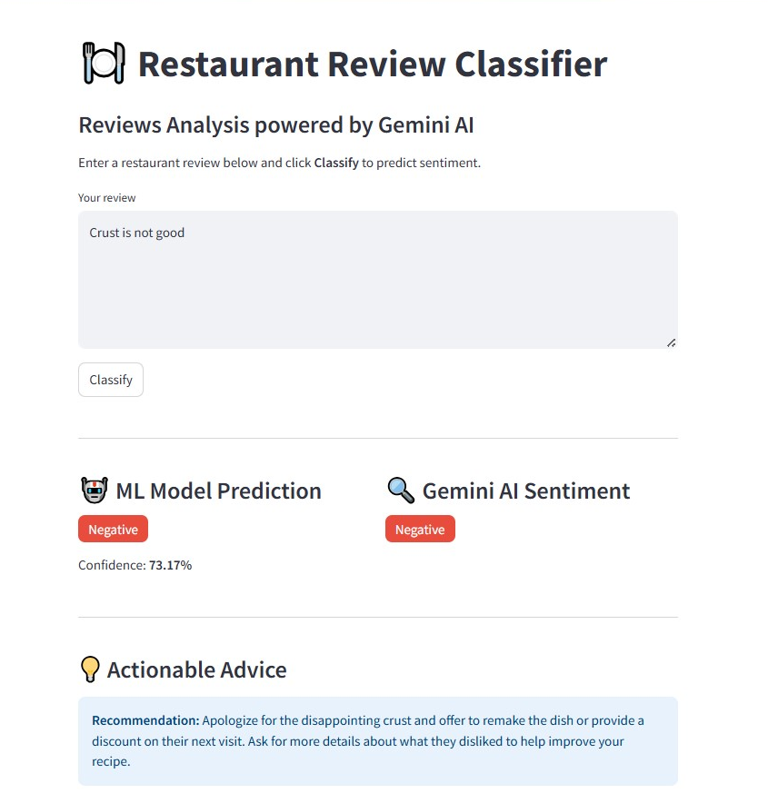
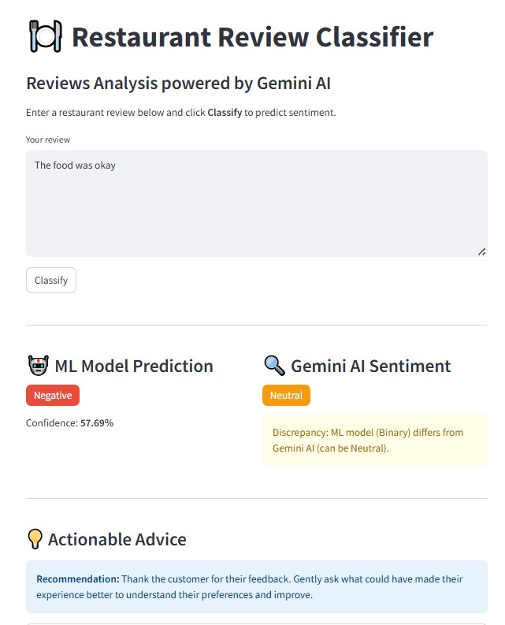

# 🍽️ Restaurant Review Sentiment Classifier

A hybrid Machine Learning + Gemini-powered app that classifies restaurant reviews as **Positive**, **Negative**, or **Neutral**, and provides actionable advice for restaurant owners.

---

## 📌 Problem Statement

Customer reviews play a crucial role in shaping the reputation and success of restaurants. Diners frequently rely on online reviews to decide where to eat, while restaurant owners use feedback to improve service and offerings. However, manually analyzing thousands of reviews is inefficient and prone to subjective interpretation.

This project builds a sentiment analysis model that automatically classifies reviews into:

- **Positive**: Indicates customer satisfaction (e.g., “Loved this place!”)
- **Negative**: Indicates dissatisfaction (e.g., “Crust is not good.”)
- **Neutral**: Used when the ML model is uncertain and Gemini provides a refined classification.

---

## 🎯 Business Impact

- **For customers**: Helps make informed dining decisions.
- **For restaurant owners**: Offers actionable insights to improve service and food quality.
- **For platforms**: Enables automated review summarization and sentiment tracking.

---

## 🧠 Technical Overview

### 📊 Dataset
- Source: `Restaurant_Reviews.tsv`
- Format: Tab-separated reviews with binary sentiment labels (Liked = 1 or 0)

### 🧹 Preprocessing
- Text cleaning (regex, lowercasing)
- Stopword removal (preserving negations like "not")
- Stemming (PorterStemmer)
- Feature extraction: character count, word count, sentence count
- Vectorization: `CountVectorizer` (max 1500 features)

### 🤖 Modeling
- Models trained: Logistic Regression, Naive Bayes, Random Forest
- Evaluation metric: Accuracy
- Best model: **Logistic Regression** (~79.5%)

### 📈 Visualization
- WordClouds for positive and negative reviews
- Feature distributions for exploratory analysis

---

## 🚀 Deployment

### 🔗 Streamlit App
- Interactive review input
- Real-time sentiment prediction
- Confidence-based Gemini integration

### 🔄 Hybrid Prediction Logic
1. **ML Model** predicts sentiment and confidence.
2. If confidence is **high** (e.g., > 95% or < 5%), Gemini returns the **same sentiment**.
3. If confidence is **low**, Gemini refines the prediction and provides **advice**.

### 🧠 Gemini API
- Model: `gemini-2.5-flash`
- Output: Structured JSON with `Sentiment` and `Advice`
- Advice examples:
  - Positive: “Thank the customer and invite them back.”
  - Negative: “Apologize and offer a fix.”
  - Neutral: “Engage for more details.”





---

## 🛠️ How to Run Locally

```bash
# Clone the repo
git clone https://github.com/souhila21/restaurant-review-classifier.git
cd restaurant-review-classifier

# Install dependencies
pip install -r requirements.txt

# Add your Gemini API key to .env
echo "GEMINI_API_KEY=your_key_here" > .env

# Run the app
streamlit run app.py
